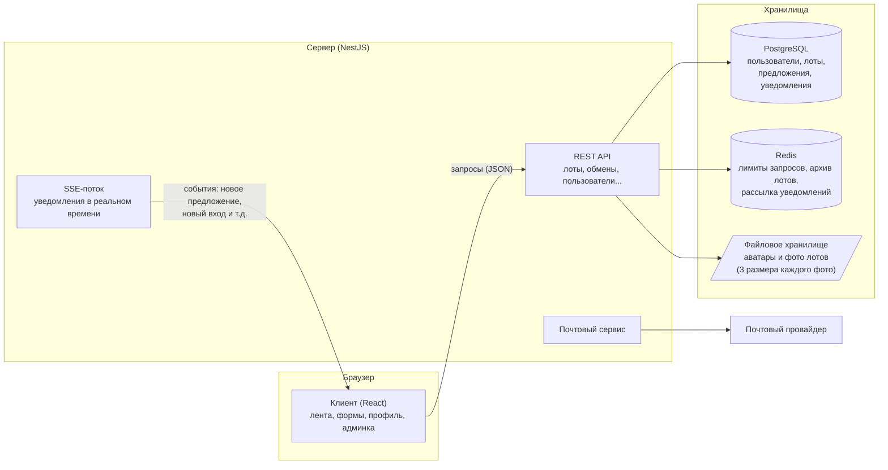
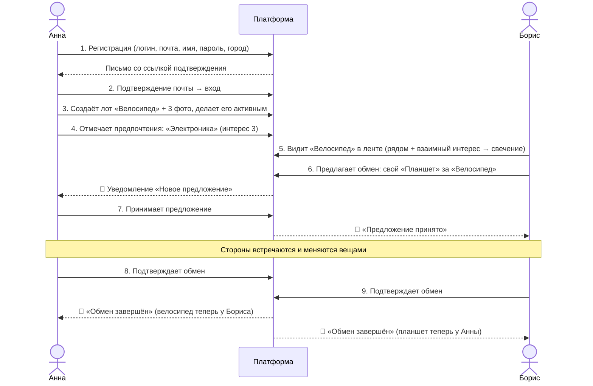
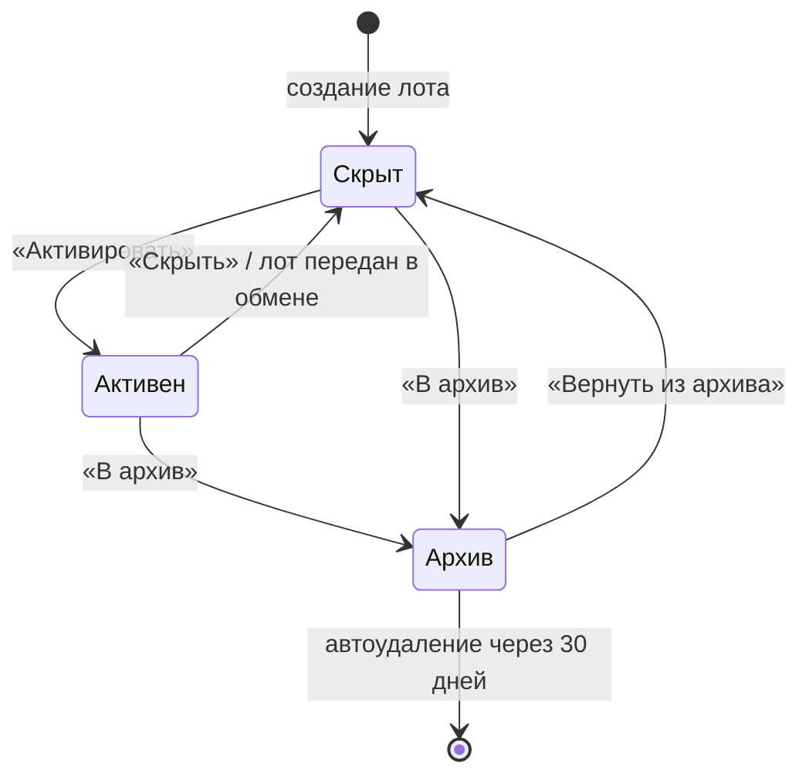
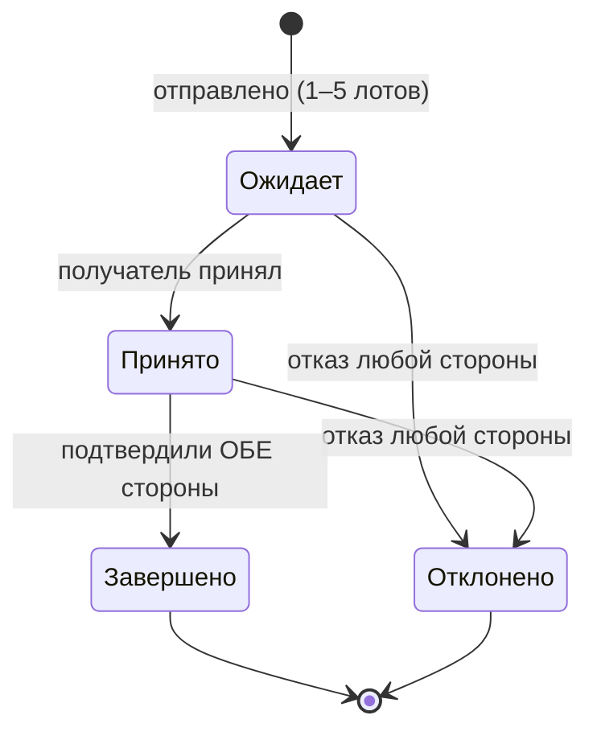

# 🤝 Barter Platform - полный путеводитель по системе

> **Площадка прямого обмена вещами без денег.**
> Пользователи выставляют свои вещи «лотами», находят чужие лоты по интересам и географии,
> предлагают обмен, договариваются и подтверждают сделку. Вся ценность - в договорённости,
> а не в цене.

Этот документ описывает **весь доступный функционал системы**: что умеет веб-приложение
(клиент), что умеет сервер, и как они работают в связке. Документ написан простым языком -
для чтения не требуется быть разработчиком. Технические детали вынесены в отдельные
разделы-справочники в конце.

---

## 📑 Оглавление

1. [Что это за система](#1-что-это-за-система)
2. [Словарь терминов](#2-словарь-терминов)
3. [Роли и права: кто что может](#3-роли-и-права-кто-что-может)
4. [Как всё устроено в связке](#4-как-всё-устроено-в-связке)
5. [Сквозной сценарий: от регистрации до обмена](#5-сквозной-сценарий-от-регистрации-до-обмена)
6. [Функционал клиента - по страницам](#6-функционал-клиента--по-страницам)
7. [Функционал сервера - по модулям](#7-функционал-сервера--по-модулям)
8. [Бизнес-правила и лимиты: все числа системы](#8-бизнес-правила-и-лимиты-все-числа-системы)
9. [Жизненные циклы: лот и предложение](#9-жизненные-циклы-лот-и-предложение)
10. [Каталог уведомлений](#10-каталог-уведомлений)
11. [Каталог писем](#11-каталог-писем)
12. [Безопасность](#12-безопасность)
13. [Данные платформы](#13-данные-платформы)
14. [Справочник API](#14-справочник-api)
15. [Инфраструктура и запуск](#15-инфраструктура-и-запуск)
16. [Что дальше: план развития](#16-что-дальше-план-развития)

---

## 1. Что это за система

**Barter Platform** - это маркетплейс, в котором нет денег и платежей. Вместо «купить»
здесь «обменять»: каждый участник публикует то, что готов отдать, указывает, что хотел бы
получить взамен (через систему предпочтений по категориям), и получает или отправляет
**предложения обмена**.

Ключевые отличия от классической доски объявлений:

- 💱 **Нет цен и оплаты.** Успешная сделка - это взаимная договорённость двух людей,
  подтверждённая обеими сторонами.
- 🧭 **Умная лента.** Система сама поднимает наверх лоты, которые (а) находятся рядом
  с вами и (б) взаимно интересны: вы хотите такое, а владельцу интересно то, что есть у вас.
- 🗂 **Глубокий каталог.** Трёхуровневое дерево: раздел → категория → подкатегория
  (19 разделов, 162 категории, 1002 подкатегории) - как на крупных досках объявлений.
- 🔔 **Живые уведомления.** Все значимые события (новое предложение, принятие, завершение
  обмена, вход с нового устройства и т.д.) приходят мгновенно, без перезагрузки страницы.
- 🌍 **4 языка интерфейса** (русский, английский, польский, немецкий) и светлая/тёмная тема.

Система состоит из двух приложений:

| Часть      | Что это                                                                          | Технологии (кратко)                            |
| ---------- | -------------------------------------------------------------------------------- | ---------------------------------------------- |
| **Клиент** | Сайт, который видит пользователь в браузере                                      | React + Mantine, мобильная и настольная версии |
| **Сервер** | «Мозг» системы: хранит данные, проверяет правила, рассылает уведомления и письма | NestJS + PostgreSQL + Redis                    |

---

## 2. Словарь терминов

| Термин                  | Что означает                                                                                                                                                      |
| ----------------------- | ----------------------------------------------------------------------------------------------------------------------------------------------------------------- |
| **Лот**                 | Публикация пользователя: вещь (или несколько единиц одной вещи), которую он готов обменять. У лота есть категория, описание, до 3 фотографий, география и статус. |
| **Таксономия**          | Дерево каталога: **раздел** (например, «Электроника») → **категория** («Телефоны») → **подкатегория** («Смартфоны»). Каждый лот привязан к этому дереву.          |
| **Предпочтения**        | Личный список интересных пользователю узлов таксономии с «силой интереса» от 1 до 3. По ним работает умная лента и проверка предложений обмена.                   |
| **Предложение (оффер)** | Заявка «меняю свои лоты на твой лот»: от 1 до 5 своих лотов против одного чужого. Проходит путь: ожидает → принято → завершено (или отклонено).                   |
| **Свечение (glow)**     | Неоновая подсветка карточки лота в ленте - визуальный индикатор силы взаимного интереса, от 1 (слабый) до 5 (максимальный).                                       |
| **Сессия**              | Один «вход» в аккаунт с конкретного устройства/браузера. Видна в профиле: устройство, IP, время активности. Можно завершить удалённо.                             |
| **Архив лота**          | «Корзина» для лота: архивный лот никому не виден, не участвует в обменах и через 30 дней автоматически удаляется навсегда. До этого его можно вернуть.            |
| **Деактивация**         | «Заморозка» аккаунта по желанию пользователя - подтверждается кодом из письма.                                                                                    |
| **Админка**             | Раздел для администраторов: управление пользователями, просмотр платформы «глазами» любого пользователя, модерация.                                               |

---

## 3. Роли и права: кто что может

В системе три роли: **Гость** (не вошёл в аккаунт), **Пользователь** и **Администратор**.

| Возможность                                                | Гость |  Пользователь  |           Администратор            |
| ---------------------------------------------------------- | :---: | :------------: | :--------------------------------: |
| Смотреть ленту активных лотов                              |  ✅   | ✅ (без своих) |   ✅ (все лоты, включая скрытые)   |
| Открывать страницу лота                                    |  ✅   |       ✅       |                 ✅                 |
| Поиск, фильтры по категориям и географии                   |  ✅   |       ✅       |                 ✅                 |
| Персональная сортировка ленты (гео + интересы)             |   -   |       ✅       |                 ✅                 |
| Зарегистрироваться / войти                                 |  ✅   |       -        |                 -                  |
| Создавать и редактировать свои лоты                        |   -   |       ✅       |          ✅ (любые лоты)           |
| Загружать фото лотов и аватар                              |   -   |       ✅       |                 ✅                 |
| Управлять статусом лота (скрыть/активировать/в архив)      |   -   |   ✅ (свои)    |             ✅ (любые)             |
| Удалять лоты безвозвратно                                  |   -   |       -        |                 ✅                 |
| Настраивать предпочтения категорий                         |   -   |       ✅       |                 ✅                 |
| Отправлять/принимать предложения обмена                    |   -   |       ✅       | ✅ + «от лица» любого пользователя |
| Жаловаться на предложение                                  |   -   |       ✅       |    - (жалобы приходят админам)     |
| Получать уведомления (в т.ч. в реальном времени)           |   -   |       ✅       |                 ✅                 |
| Профиль: контакты, язык, тема, аватар                      |   -   |       ✅       |                 ✅                 |
| Смотреть свои сессии и завершать их                        |   -   |       ✅       |                 ✅                 |
| Смотреть/завершать сессии **других** пользователей         |   -   |       -        |                 ✅                 |
| Деактивировать свой аккаунт (код из письма)                |   -   |       ✅       |                 ✅                 |
| Таблица всех пользователей, поиск, фильтры                 |   -   |       -        |                 ✅                 |
| Создавать/редактировать/удалять пользователей, менять роли |   -   |       -        |                 ✅                 |
| Смотреть «Мои лоты» и «Предложения» любого пользователя    |   -   |       -        |                 ✅                 |

> 💡 **Принцип «от лица пользователя»**: администратор может открыть ленту предложений,
> список лотов или конкретное предложение так, как их видит выбранный пользователь. Это
> главный инструмент разбора жалоб и поддержки. Для обычных пользователей этот параметр
> просто игнорируется - подделать его нельзя.

---

## 4. Как всё устроено в связке



Как это читать:

1. **Клиент** - то, что открывается в браузере. Он ничего не хранит «по-настоящему»:
   каждое действие (создать лот, принять предложение, сменить язык) превращается в запрос
   к серверу.
2. **Сервер** принимает запросы, проверяет права и бизнес-правила (например, «нельзя
   предложить обмен на собственный лот»), сохраняет данные в **PostgreSQL** и отвечает
   клиенту.
3. **Redis** - быстрая вспомогательная память: учёт лимитов запросов (защита от
   перегрузки), сроки автоудаления архивных лотов и «почтовый голубь» для мгновенной
   доставки уведомлений (работает даже если серверов несколько).
4. **Уведомления в реальном времени** доставляются по открытому SSE-соединению
   (Server-Sent Events): сервер «проталкивает» событие в браузер сразу, как оно произошло -
   колокольчик в шапке обновляется без перезагрузки.
5. **Письма** (подтверждение почты, сброс пароля, код деактивации) сервер отправляет через
   почтовый сервис на языке пользователя.
6. **Фотографии** хранятся на диске сервера; каждое фото лота сервер автоматически
   пережимает в три размера (полный / средний / миниатюра), чтобы лента грузилась быстро.

---

## 5. Сквозной сценарий: от регистрации до обмена

Полный «счастливый путь» двух пользователей - Анны и Бориса:



Что происходит «за кулисами» на каждом шаге:

1. **Регистрация.** Анна указывает логин, e-mail, имя, пароль, телефон (по желанию)
   и местоположение (область → город → район). Сервер проверяет уникальность логина
   и почты и отправляет письмо со ссылкой подтверждения.
2. **Подтверждение почты.** Без него войти нельзя - это защита от фейковых аккаунтов.
   Письмо можно запросить повторно. После входа Анна получает пару токенов: короткоживущий
   «пропуск» и долгоживущий «ключ продления» (хранится в защищённой cookie).
3. **Создание лота.** Анна выбирает раздел/категорию/подкатегорию, пишет общее описание и
   характеристики, указывает количество и географию, загружает до 3 фото (первое становится
   главным). Новый лот создаётся **скрытым** - Анна сама решает, когда нажать «Активировать».
4. **Предпочтения.** В профиле Анна отмечает интересные ей узлы каталога с силой 1–3.
   Это влияет на её ленту и на то, какие лоты ей можно предлагать в обмен.
5. **Умная лента Бориса.** Сервер сортирует лоты: сначала «рядом» (его район > город >
   область), затем по взаимному интересу: Борис хочет велосипед (его предпочтение), а Анна
   хочет электронику - у Бориса есть активный планшет. Карточка велосипеда светится.
6. **Предложение.** В модальном окне Борис выбирает от 1 до 5 своих лотов. Система
   показывает только те его лоты, которые попадают в предпочтения Анны (сами предпочтения
   при этом не раскрываются - только факт «подходит/не подходит»). Сервер дополнительно
   проверяет: лот Анны активен и не принадлежит Борису, нет дубликата или «зеркального»
   встречного предложения, с прошлого предложения этому лоту прошёл час.
7. **Принятие.** Только Анна (получатель) может принять. Любая из сторон может отказаться
   на любом этапе до завершения.
   8–9. **Двойное подтверждение.** Сделка считается завершённой, только когда **обе** стороны
   подтвердили факт обмена. В этот момент сервер атомарно (всё или ничего): передаёт
   велосипед в аккаунт Бориса, планшет - Анне; все переданные лоты становятся скрытыми
   (новый владелец сам решит, выставлять ли их); все другие активные предложения, которые
   ссылались на эти лоты, автоматически отклоняются, а их участники получают уведомления.

---

## 6. Функционал клиента - по страницам

### 6.1 Каркас приложения (виден везде)

- **Шапка** - две версии: настольная и мобильная. Содержит:
  - 🔔 **Колокольчик уведомлений** со счётчиком непрочитанных. Открывает выдвижную панель
    со списком уведомлений: прочитать одно, прочитать все, перейти по клику к связанной
    сущности (предложению, лоту). Новые уведомления прилетают в реальном времени.
  - 👤 **Меню пользователя** - переходы в профиль, выход.
- **Навигация** - слева на десктопе, нижняя панель на мобильных + выдвижной профиль-дровер:
  - 🏠 Главная (доступна всем),
  - 👤 Профиль (требует входа),
  - 🤝 Предложения (требует входа),
  - 🛡 Админка (только администратор).
    Пункты, требующие входа, для гостя помечаются предупреждающим значком.
- **Скорость**: страницы подгружаются лениво (по мере необходимости), а при наведении на
  пункт меню нужная страница начинает загружаться заранее - переходы ощущаются мгновенными.
- **Темы и языки**: светлая / тёмная / системная тема, 4 языка интерфейса. Выбор
  сохраняется в профиле и применяется на любом устройстве после входа.
- **Защита от перегрузки**: если сервер ответил «слишком много запросов», клиент показывает
  это пользователю и знает, через сколько секунд можно продолжить.
- Любой несуществующий адрес ведёт на главную.

### 6.2 Главная - лента лотов (`/`)

- Карточки активных лотов с главным фото (быстрая миниатюра), описанием, категорией
  и географией. Постраничная подгрузка (по 20).
- 🔍 **Поиск** по тексту обоих описаний лота.
- 🗂 **Фильтр по каталогу** - выдвижная панель с деревом раздел → категория → подкатегория.
- 📍 **Гео-фильтр** - область → город → район.
- ✨ **Свечение релевантности** (только для вошедших): карточки взаимно интересных лотов
  подсвечиваются анимированной неоновой рамкой, интенсивность 1–5. Свечение отражает именно
  взаимный «бартерный» интерес; близость по карте влияет на порядок, но не на свечение.
- Свои лоты в общей ленте не показываются - для них есть «Мои лоты».
- Гостям лента тоже доступна (обычная сортировка по свежести, без персонализации).

### 6.3 Страница лота (`/lot/:id`)

- Галерея фотографий (полноразмерные версии), оба описания, количество, категория,
  география, дата публикации.
- **Для владельца** - панель действий: редактировать, сменить статус
  (активировать / скрыть / в архив / вернуть из архива). Для архивного лота показывается
  дата, после которой он будет удалён навсегда.
- **Для чужого пользователя** - кнопка **«Предложить обмен»**: модальное окно, в котором
  можно выбрать от 1 до 5 своих лотов. Доступность каждого лота определяется
  предпочтениями владельца (лоты «мимо интересов» выбрать нельзя), сами предпочтения
  не раскрываются.
- Страница умеет отдаваться из кеша браузера и мгновенно обновляться, если лот изменился
  (механизм ETag).

### 6.4 Создание и редактирование лота (`/lot/create`, `/lot/edit/:id`)

- Пошаговая форма: каталог (подкатегория обязательна, если она существует у категории) →
  описания → количество → география → фотографии.
- Загрузка до **3 фото** (PNG/JPG, до 8 МБ каждое), выбор главного фото, удаление.
  Сервер сам создаёт три размера каждой картинки.
- Новый лот всегда создаётся **скрытым** - публикация отдельным осознанным действием.
- Редактирование доступно владельцу (архивный лот пользователь редактировать не может -
  сначала надо вернуть его из архива; админ может всё).

### 6.5 Мои лоты (`/my-lots`)

- Личная лента всех своих лотов **во всех статусах**: активные, скрытые, архивные.
- Те же карточки и действия, что и в общей ленте + управление статусами.
- 🛡 Администратор видит на этой странице селектор пользователя и может открыть «Мои лоты»
  любого участника платформы.

### 6.6 Предложения (`/offers`)

- Два режима: **входящие** (мне предложили) и **исходящие** (я предложил).
- Фильтр по статусам (ожидает / принято / завершено / отклонено), постраничный список,
  сортировка по дате последнего изменения.
- Карточка предложения: целевой лот, предлагаемые лоты, участники, статус-бейдж.
- Если какой-то из лотов предложения был удалён администратором, он просто исчезает из
  списка предлагаемых - карточка не ломается.
- 🛡 Администратору доступен селектор «смотреть от лица пользователя».

### 6.7 Страница предложения (`/offers/:id`)

Доступна только участникам предложения (и администратору «от лица» участника).

- Шапка с участниками и датами, **блок обмена** («отдаёшь ↔ получаешь») и **степпер
  статуса** - визуальный прогресс сделки.
- Кнопки по ситуации:
  - **Принять** - только получатель, пока предложение «ожидает»;
  - **Отклонить / отменить** - любой участник до завершения;
  - **Подтвердить обмен** - каждый участник после принятия; сделка завершается, когда
    подтвердили оба;
  - **Пожаловаться** - сигнал всем администраторам (админ откроет предложение глазами
    автора жалобы).

### 6.8 Профиль (`/profile`) и чужой профиль (`/users/:id`)

Свой профиль состоит из блоков:

- **Шапка**: аватар (загрузка PNG/JPG до 5 МБ - обрезается в квадрат, удаление), имя, логин.
- **Контакты**: e-mail, телефон, местоположение (область/город/район). Редактирование
  имени, телефона, географии, языка и темы.
- **Предпочтения каталога**: выбор интересных разделов/категорий/подкатегорий с силой
  интереса 1–3; кнопки «выбрать всё» (всё с силой 1) и «сбросить всё». Это топливо для
  умной ленты и фильтра предложений.
- **Сессии**: список активных входов (устройство, IP, время последней активности,
  текущая сессия помечена). Можно завершить конкретную сессию или **все, кроме текущей** -
  например, если забыли выйти на чужом компьютере.
- **Деактивация аккаунта**: запрос кода на почту → ввод кода → аккаунт заморожен.

Чужой профиль показывает публичную информацию пользователя. Администратору в профиле
пользователя доступно больше данных и действий (вкл. управление сессиями).

### 6.9 Админ-панель (`/admin`)

- Таблица всех пользователей: постраничная, с сортировкой по колонкам, изменяемой шириной
  колонок (настройки запоминаются), фильтрами и быстрым поиском по логину/имени/почте.
- Клик по строке открывает профиль пользователя.
- Действия администратора над пользователем: редактирование данных, смена роли
  (пользователь ↔ администратор), активация/деактивация, удаление, создание нового
  пользователя вручную, завершение сессий.
- Плюс уже упомянутые «от лица пользователя» режимы на страницах лотов и предложений.

### 6.10 Вход и служебные страницы

- **`/auth`** - вход и регистрация на одной странице:
  - вход по **логину или e-mail** + пароль, флажок «запомнить меня»;
  - понятные ошибки: неверные данные, почта не подтверждена (с кнопкой «отправить письмо
    ещё раз»), аккаунт деактивирован, превышен лимит одновременных сессий (с предложением
    завершить остальные), слишком много попыток входа;
  - регистрация: логин, e-mail, имя, пароль, телефон (по желанию), область/город/район.
- **`/mail-confirm`** - страница, на которую ведёт ссылка из письма; подтверждает почту.
- **`/reset-password`** - установка нового пароля по ссылке из письма
  (ссылка одноразовая, живёт 1 час). Запрос сброса - с формы входа («забыли пароль?»).

### 6.11 «Невидимый» функционал клиента

То, что пользователь не видит, но постоянно использует:

- **Автопродление входа**: когда короткий «пропуск» истекает, клиент незаметно обновляет
  его по защищённой cookie - пользователя не выбрасывает из аккаунта.
- **Восстановление сессии при загрузке**: открыли вкладку - вы уже в аккаунте.
- **Язык в каждом запросе**: сервер отвечает (и шлёт письма) на языке пользователя.
- **Проверка ответов сервера**: каждый ответ проверяется по схеме - повреждённые данные
  не попадут в интерфейс.
- **Кеширование запросов** (React Query): данные не запрашиваются повторно без нужды,
  списки обновляются в фоне.

---

## 7. Функционал сервера - по модулям

Сервер построен из 14 независимых модулей. Ниже - что делает каждый, человеческим языком.

### 7.1 🔐 Auth - вход и токены

- Проверяет пару «логин-или-почта + пароль» (пароли хранятся только в виде bcrypt-хеша).
- Выдаёт два токена: **access** (короткий пропуск, отправляется с каждым запросом) и
  **refresh** (ключ продления, живёт в httpOnly-cookie - недоступен скриптам на странице).
- «Запомнить меня» продлевает жизнь сессии.
- Следит за лимитом **одновременных сессий (до 3)**: при превышении вход блокируется
  с предложением завершить старые сессии.
- Отдельный счётчик попыток входа: перебор паролей блокируется (ошибка 429).
- Обновление токенов проверяет целостность сессии (тот ли пользователь, та ли сессия,
  не отозвана ли). Выход гасит текущую сессию.

### 7.2 📱 Sessions - учёт устройств

- Каждый вход создаёт запись: IP, браузер/устройство (user-agent), идентификатор устройства
  (постоянная cookie), время создания, последней активности и истечения.
- Пользователь: список своих сессий, завершение одной, завершение всех кроме текущей.
- Администратор: то же самое для любого пользователя.
- О входе с нового устройства, смене пароля и принудительном завершении сессии пользователь
  получает уведомления.

### 7.3 👥 Users - пользователи и география

- Регистрация (с проверкой уникальности логина/почты и существования указанной географии).
- Профиль: свой (полные данные), чужой (публичные данные), админский (всё).
- Редактирование себя: имя, телефон, география, язык, тема.
- Админ: список с пагинацией/сортировкой/фильтрами, поиск по логину/имени/почте,
  создание, редактирование (включая роль и статус), удаление.
- Справочники географии: области → города → районы (вложенные списки для форм).

### 7.4 ⭐ User Preferences - предпочтения каталога

- Хранит интересы пользователя: узел каталога + сила интереса 1–3 (на каждом из трёх
  уровней дерева).
- Операции: получить свои, полностью заменить, сбросить, «выбрать всё» (с силой 1).
- **Маскированная выдача** для других: посторонний может узнать только «попадает ли мой
  лот в интересы этого человека», но не сами интересы и не их силу.

### 7.5 📦 Lots - лоты, каталог и архив

- CRUD лотов с проверкой каталога (подкатегория обязательна, если существует) и географии.
- Правила видимости ленты: гость - активные; пользователь - активные чужие; режим
  «мои лоты» - все свои; админ - всё.
- Фильтры: категории, география, текстовый поиск; пагинация.
- **Рекомендательная сортировка** (см. раздел 8): география → взаимный интерес → свежесть;
  каждой карточке присваивается уровень свечения 0–5.
- **Архив**: дата архивации хранится в Redis; фоновая задача удаляет лоты, пролежавшие
  в архиве **30 дней**, заранее присылая владельцу уведомление о запланированном удалении.
- Кеширование страницы лота по ETag (повторный просмотр не качает данные заново).
- Удаление лота - привилегия администратора (пользователь пользуется архивом).

### 7.6 🤝 Offers - предложения обмена

Самый «правиловый» модуль. При создании предложения сервер проверяет шесть условий:

1. Целевой лот существует, **активен** и **не принадлежит** предлагающему.
2. Предлагаются от 1 до 5 **собственных** лотов, не из архива (активные и скрытые - можно).
3. Каждый предлагаемый лот **попадает в предпочтения** получателя.
4. Нет другого активного предложения от этого же человека на этот же лот.
5. Нет «зеркального» встречного предложения (когда стороны и лоты поменяны местами).
6. С прошлого предложения этому лоту (даже отклонённого) прошёл **минимум 1 час** -
   защита от спама; сервер сообщает, сколько осталось ждать.

Дальше - жизненный цикл (принять/отклонить/двойное подтверждение, см. раздел 9). Завершение
обмена выполняется **атомарно**: передача лотов новым владельцам, скрытие переданных лотов
и авто-отклонение конкурирующих предложений происходят как единое целое - система не может
«застрять посередине». Все затронутые участники получают уведомления.

Жалоба на предложение рассылается всем администраторам.

### 7.7 🔔 Notifications - уведомления

- Хранение, список с пагинацией и фильтром «только непрочитанные», счётчик непрочитанных,
  отметка одного/всех прочитанными.
- **Реальное время**: открытый SSE-поток на пользователя; рассылка через Redis pub/sub -
  событие долетит до пользователя, даже если серверов несколько и его соединение открыто
  на другом экземпляре.
- В уведомлении хранится не готовый текст, а тип события + данные (имена, названия,
  количества). Текст собирает клиент на языке пользователя - переключили язык интерфейса,
  и вся история уведомлений «переведена». К уведомлению может быть привязана сущность
  для перехода по клику (предложение, лот).

### 7.8 🖼 Media - изображения

- **Аватар**: PNG/JPG до 5 МБ → обрезается и масштабируется в квадрат 300×300; новый
  аватар замещает старый; можно удалить.
- **Фото лота**: PNG/JPG до 8 МБ, максимум 3 на лот. Из каждого фото создаются три версии:
  оригинал (до 2000 px), средняя (до 1100 px) и миниатюра (до 320 px) - лента грузит
  миниатюры, страница лота - крупные версии. Первое загруженное фото становится главным;
  главное можно сменить; фото можно удалить.
- Пакетная выдача главных фото для списка лотов (до 100 за запрос) - так лента получает
  все картинки одним обращением.
- Право управлять фото лота - у владельца лота и администратора.

### 7.9 ✉️ Mail, Mail-confirm, Password-reset, Deactivation - почтовые сценарии

- **Mail** - общий отправщик писем (nodemailer): шаблоны на 4 языках, письмо уходит
  на языке получателя.
- **Mail-confirm** - подтверждение почты по ссылке из письма + повторная отправка письма.
- **Password-reset** - запрос сброса (письмо со ссылкой: одноразовая, 1 час) и установка
  нового пароля.
- **Deactivation** - запрос кода деактивации (письмо с кодом: 30 минут) и подтверждение.
  После деактивации вход невозможен, пока администратор не вернёт аккаунт.

### 7.10 🚦 Redis + Throttling - защита от перегрузки

- Все запросы проходят через лимитер на базе Redis: **20 запросов за 5 секунд** на
  обычные операции и отдельная «дешёвая» корзина **100 за 5 секунд** для проверок кеша
  (ETag). Превышение → ответ 429 с заголовком «повторите через N секунд», который клиент
  показывает пользователю.
- Redis также хранит данные сессий, сроки архива лотов и служит шиной уведомлений.

### 7.11 🧰 Сквозная инфраструктура сервера

- **Валидация каждого запроса** (class-validator/DTO): некорректные данные отбрасываются
  до бизнес-логики, с понятным описанием ошибки.
- **Стабильные коды ошибок** (`INVALID_CREDENTIALS`, `MAX_LOT_IMG`, …) - клиент показывает
  локализованные сообщения, а не сырые тексты сервера.
- **Логирование** (winston): все запросы и ошибки пишутся в файлы логов.
- **Swagger** - автоматическая интерактивная документация всех API.
- **Миграции БД** (TypeORM) и **сиды** - версионирование схемы и начальные данные.

---

## 8. Бизнес-правила и лимиты: все числа системы

### 8.1 Сводная таблица лимитов

| Правило                               | Значение                                       |
| ------------------------------------- | ---------------------------------------------- |
| Одновременные сессии на аккаунт       | **3**                                          |
| Фото на один лот                      | **до 3**                                       |
| Размер фото лота                      | **до 8 МБ** (PNG/JPG)                          |
| Размер аватара                        | **до 5 МБ** (PNG/JPG)                          |
| Версии каждого фото лота              | 3 (≤2000 px / ≤1100 px / ≤320 px)              |
| Аватар после обработки                | 300×300                                        |
| Лотов в одном предложении обмена      | **от 1 до 5**                                  |
| Пауза между предложениями одному лоту | **1 час** (включая отклонённые)                |
| Жизнь лота в архиве до автоудаления   | **30 дней**                                    |
| Срок ссылки сброса пароля             | **1 час**, одноразовая                         |
| Срок кода деактивации                 | **30 минут**                                   |
| Лента лотов на страницу               | 20                                             |
| Таблица пользователей в админке       | 10 на страницу (по умолчанию)                  |
| Общий лимит запросов                  | 20 за 5 секунд (кеш-проверки: 100 за 5 секунд) |
| Сила интереса в предпочтениях         | 1–3                                            |
| Уровни свечения карточки              | 0–5                                            |
| Пакетная выдача главных фото          | до 100 лотов за запрос                         |
| Пароль / логин                        | 8–60 символов                                  |
| Имя                                   | 5–200 символов                                 |

### 8.2 Как считается умная лента (без формул на пальцах)

Сортировка ленты для вошедшего пользователя - три яруса, по убыванию важности:

1. **География - главный ярус.** Лот из вашего района всегда выше лота из вашего города,
   тот - выше лота из вашей области, и только потом всё остальное. Логика бартера:
   меняться нужно там, куда можно доехать.
2. **Взаимный интерес (affinity)** - складывается из двух половинок:
   - _«Я хочу твоё»_ - насколько лот попадает в ваши предпочтения. Совпадение по
     подкатегории ценится в 10 раз дороже совпадения по категории и в 100 раз - по разделу;
     сила интереса (1–3) умножает результат.
   - _«Ты хочешь моё»_ - насколько ваши собственные активные лоты попадают в предпочтения
     владельца этого лота. То есть система заранее прикидывает шансы на встречный интерес.
3. **Свежесть** - при прочих равных новое выше старого.

Из второго яруса вычисляется **свечение 1–5** на карточке: чем сильнее взаимный интерес,
тем ярче. География на свечение не влияет - она влияет только на порядок.

> Если пользователь сам включил фильтр по категории или географии - соответствующий ярус
> персонализации отключается (фильтр главнее рекомендаций). Гость и режим «Мои лоты»
> всегда видят простую сортировку по свежести.

---

## 9. Жизненные циклы: лот и предложение

### 9.1 Лот



- **Скрыт** - видит только владелец (и админ). Скрытые лоты _можно_ предлагать в обмен.
- **Активен** - виден всем в ленте, на него можно получать предложения.
- **Архив** - «предкорзина»: невидим, в обменах не участвует, владелец не может его
  редактировать (только вернуть), через 30 дней удаляется навсегда (с предупреждением).
- После успешного обмена лот меняет владельца и автоматически становится **скрытым**.

### 9.2 Предложение обмена



- **Завершено** - терминальный успех: лоты переданы новым владельцам, конкуренты
  авто-отклонены.
- **Отклонено** - терминальный отказ: можно предложить заново, но не раньше, чем через час.

---

## 10. Каталог уведомлений

Все события, о которых система сообщает пользователю (🔔 - приходят и в реальном времени).

### Обмены

| Событие                     | Кто получает                                         |
| --------------------------- | ---------------------------------------------------- |
| 🔔 Новое предложение обмена | владелец целевого лота                               |
| 🔔 Предложение принято      | предлагавший                                         |
| 🔔 Предложение отклонено    | вторая сторона (не та, что отклонила)                |
| 🔔 Обмен завершён           | обе стороны + участники авто-отклонённых предложений |

### Безопасность аккаунта

| Событие                      | Когда                                |
| ---------------------------- | ------------------------------------ |
| 🔔 Вход с нового устройства  | каждый новый вход                    |
| 🔔 Пароль изменён            | после сброса/смены пароля            |
| 🔔 Сессия завершена          | при принудительном завершении сессии |
| 🔔 Подозрительная активность | по решению системы/админа            |

### Аккаунт и модерация

| Событие                                  | Когда                                         |
| ---------------------------------------- | --------------------------------------------- |
| 🔔 Сообщение от администрации            | админ пишет пользователю напрямую             |
| 🔔 Аккаунт деактивирован / восстановлен  | смена статуса аккаунта                        |
| 🔔 Роль изменена                         | назначение/снятие администратора              |
| 🔔 Лот деактивирован / удалён модерацией | действия админа с лотом                       |
| 🔔 Запланировано удаление лота           | лот в архиве приближается к 30-дневному сроку |
| 🔔 Жалоба на предложение                 | **всем администраторам**                      |

### Зарезервировано на будущее

| Событие                | Статус                                   |
| ---------------------- | ---------------------------------------- |
| Новое сообщение в чате | тип заложен в систему, ждёт модуль чатов |

> Текст каждого уведомления собирается на клиенте на текущем языке интерфейса; по клику
> уведомление ведёт к связанной сущности (предложению, лоту), если переход имеет смысл.

---

## 11. Каталог писем

Все письма отправляются **на языке пользователя** (ru / en / pl / de), свёрстаны для
почтовых клиентов.

| Письмо                      | Когда отправляется                       | Срок действия              |
| --------------------------- | ---------------------------------------- | -------------------------- |
| ✉️ Подтверждение почты      | после регистрации; повторно - по запросу | до подтверждения           |
| ✉️ Сброс пароля             | по запросу «забыли пароль»               | ссылка: 1 час, одноразовая |
| ✉️ Код деактивации аккаунта | по запросу деактивации                   | код: 30 минут              |

---

## 12. Безопасность

| Механизм                                      | Что даёт                                                                             |
| --------------------------------------------- | ------------------------------------------------------------------------------------ |
| Пароли - только bcrypt-хеши                   | даже при утечке БД пароли не восстановить                                            |
| Access + refresh токены                       | короткий «пропуск» + ключ продления в httpOnly-cookie (недоступен скриптам страницы) |
| Привязка сессии к устройству                  | cookie устройства + проверка соответствия сессии при продлении                       |
| Лимит 3 сессии                                | чужой не накопит «тихих» входов; пользователь видит и может завершить каждую сессию  |
| Уведомления о входах и смене пароля           | мгновенный сигнал о компрометации                                                    |
| Подтверждение почты до первого входа          | отсечение фейковых регистраций                                                       |
| Лимит попыток входа + общий троттлинг (Redis) | защита от перебора паролей и перегрузки                                              |
| Деактивация - только с кодом из письма        | аккаунт нельзя «заморозить» без доступа к почте                                      |
| Маскирование предпочтений                     | посторонние видят только «подходит/не подходит», не сами интересы                    |
| Проверка прав на каждом действии              | владелец/участник/админ - на уровне сервера, не интерфейса                           |
| Валидация всех входных данных                 | мусор отбрасывается до бизнес-логики                                                 |
| Атомарное завершение обмена                   | лоты не могут «зависнуть» между владельцами                                          |
| Логирование (winston)                         | разбор инцидентов по файлам логов                                                    |

---

## 13. Данные платформы

| Справочник               | Объём    | Примечания                                    |
| ------------------------ | -------- | --------------------------------------------- |
| Разделы каталога         | **19**   | «Недвижимость», «Электроника», …              |
| Категории                | **162**  | внутри разделов                               |
| Подкатегории             | **1002** | самый точный уровень; обязательны при наличии |
| Области                  | **6**    | география Беларуси                            |
| Города и нас. пункты     | **171**  | привязаны к областям                          |
| Районы городов           | **22**   | для крупных городов                           |
| Языки интерфейса и писем | **4**    | ru, en, pl, de                                |
| Темы интерфейса          | **3**    | светлая, тёмная, системная                    |

Все справочники загружаются в базу автоматически при первом запуске (сиды), вместе
с учётной записью администратора. Для разработки есть отдельный сидер
(`npm run seed:dev`), наполняющий базу тестовыми пользователями, лотами и предложениями.

---

## 14. Справочник API

> Раздел для технически любопытных: полная карта точек входа сервера. Интерактивная
> документация со схемами запросов/ответов доступна в Swagger при запущенном сервере.

<details>
<summary><b>🔐 Аутентификация - <code>/auth</code></b></summary>

| Метод | Путь            | Что делает                                       |
| ----- | --------------- | ------------------------------------------------ |
| POST  | `/auth/login`   | вход по логину/почте + паролю («запомнить меня») |
| POST  | `/auth/refresh` | продление access-токена по refresh-cookie        |
| POST  | `/auth/logout`  | выход (закрытие текущей сессии)                  |

</details>

<details>
<summary><b>👥 Пользователи и география - <code>/user</code></b></summary>

| Метод  | Путь                                               | Что делает                                             |
| ------ | -------------------------------------------------- | ------------------------------------------------------ |
| POST   | `/user/register`                                   | регистрация                                            |
| GET    | `/user/geography/regions` / `cities` / `districts` | справочники географии                                  |
| GET    | `/user/self`                                       | свой профиль                                           |
| PATCH  | `/user/self`                                       | редактирование своего профиля                          |
| GET    | `/user/:id`                                        | профиль пользователя                                   |
| GET    | `/user`                                            | 🛡 список пользователей (пагинация/сортировка/фильтры) |
| GET    | `/user/search`                                     | 🛡 поиск по логину/имени/почте                         |
| POST   | `/user`                                            | 🛡 создать пользователя                                |
| PATCH  | `/user/:id`                                        | 🛡 редактировать (вкл. роль, статус)                   |
| DELETE | `/user/:id`                                        | 🛡 удалить                                             |

</details>

<details>
<summary><b>⭐ Предпочтения - <code>/user-preferences</code></b></summary>

| Метод  | Путь                                     | Что делает                              |
| ------ | ---------------------------------------- | --------------------------------------- |
| GET    | `/user-preferences/me`                   | мои предпочтения                        |
| PUT    | `/user-preferences/me`                   | полная замена                           |
| DELETE | `/user-preferences/me`                   | сброс                                   |
| POST   | `/user-preferences/me/select-all`        | выбрать всё (сила 1)                    |
| GET    | `/user-preferences/:userId/availability` | маскированные предпочтения пользователя |

</details>

<details>
<summary><b>📦 Лоты и каталог - <code>/lot</code></b></summary>

| Метод  | Путь            | Что делает                                         |
| ------ | --------------- | -------------------------------------------------- |
| GET    | `/lot/taxonomy` | дерево каталога                                    |
| GET    | `/lot`          | лента (пагинация, фильтры, selfOnly, рекомендации) |
| GET    | `/lot/:id`      | один лот (с ETag-кешем)                            |
| POST   | `/lot`          | создать лот                                        |
| PATCH  | `/lot/:id`      | редактировать (владелец/админ), смена статуса      |
| DELETE | `/lot/:id`      | 🛡 удалить навсегда                                |

</details>

<details>
<summary><b>🤝 Предложения - <code>/offers</code></b></summary>

| Метод | Путь                          | Что делает                                         |
| ----- | ----------------------------- | -------------------------------------------------- |
| POST  | `/offers`                     | создать предложение (1–5 лотов)                    |
| GET   | `/offers`                     | моя лента (входящие/исходящие, статусы, пагинация) |
| GET   | `/offers/:id`                 | детали (только участник)                           |
| GET   | `/offers/availability/:lotId` | «какие мои лоты подойдут» (маскированно)           |
| POST  | `/offers/:id/accept`          | принять (получатель)                               |
| POST  | `/offers/:id/reject`          | отклонить/отменить (любой участник)                |
| POST  | `/offers/:id/confirm`         | подтвердить обмен (нужны оба)                      |
| POST  | `/offers/:id/report`          | пожаловаться (уйдёт всем админам)                  |

🛡 Везде поддерживается `asUserId` - режим «от лица пользователя» для администратора.

</details>

<details>
<summary><b>🔔 Уведомления - <code>/notifications</code></b></summary>

| Метод | Путь                          | Что делает                               |
| ----- | ----------------------------- | ---------------------------------------- |
| GET   | `/notifications`              | список (пагинация, фильтр непрочитанных) |
| GET   | `/notifications/unread-count` | счётчик непрочитанных                    |
| PATCH | `/notifications/:id/read`     | прочитать одно                           |
| PATCH | `/notifications/read-all`     | прочитать все                            |
| GET   | SSE-поток                     | события в реальном времени               |

</details>

<details>
<summary><b>🖼 Медиа - <code>/media</code></b></summary>

| Метод  | Путь                                   | Что делает                         |
| ------ | -------------------------------------- | ---------------------------------- |
| POST   | `/media/avatar`                        | загрузить аватар (≤5 МБ)           |
| DELETE | `/media/avatar`                        | удалить аватар                     |
| GET    | `/media/avatars/:userId`               | получить аватар                    |
| POST   | `/media/lots/:lotId/images`            | загрузить фото лота (≤8 МБ, до 3)  |
| POST   | `/media/lots/:lotId/images/primary`    | назначить главное фото             |
| GET    | `/media/lots/:lotId/images`            | фото лота                          |
| GET    | `/media/lots/images/:imageId/original` | конкретное фото                    |
| POST   | `/media/lots/main-images`              | главные фото пачкой (до 100 лотов) |
| DELETE | `/media/lots/images/:imageId`          | удалить фото                       |

</details>

<details>
<summary><b>📱 Сессии - <code>/sessions</code></b></summary>

| Метод  | Путь                          | Что делает                           |
| ------ | ----------------------------- | ------------------------------------ |
| GET    | `/sessions`                   | мои активные сессии                  |
| DELETE | `/sessions/:id`               | завершить свою сессию                |
| DELETE | `/sessions`                   | завершить все, кроме текущей         |
| GET    | `/sessions/users/:userId`     | 🛡 сессии пользователя               |
| DELETE | `/sessions/users/:userId`     | 🛡 завершить все сессии пользователя |
| DELETE | `/sessions/users/:userId/:id` | 🛡 завершить конкретную              |

</details>

<details>
<summary><b>✉️ Почтовые сценарии</b></summary>

| Метод | Путь                          | Что делает                  |
| ----- | ----------------------------- | --------------------------- |
| GET   | `/mail-confirm/confirm-email` | подтвердить почту по токену |
| POST  | `/mail-confirm/resend`        | отправить письмо повторно   |
| POST  | `/password-reset/request`     | запросить сброс пароля      |
| POST  | `/password-reset/confirm`     | установить новый пароль     |
| POST  | `/deactivation/request`       | запросить код деактивации   |
| POST  | `/deactivation/confirm`       | подтвердить деактивацию     |

</details>

🛡 - только для администратора.

---

## 15. Инфраструктура и запуск

Вся система поднимается одной командой через Docker:

```bash
# Разработка (hot-reload)
docker compose -f docker/docker-compose.dev.yml up --build

# Продакшн
docker compose -f docker/docker-compose.prod.yml up --build -d
```

| Контейнер         | Роль                             | Порт |
| ----------------- | -------------------------------- | ---- |
| `barter-client`   | сайт (nginx со статикой клиента) | 80   |
| `barter-server`   | API-сервер (NestJS)              | 3000 |
| `barter-postgres` | база данных (PostgreSQL 15)      | 5432 |
| `barter-redis`    | быстрая память (Redis 7)         | 6379 |

- Медиафайлы и данные БД хранятся в Docker-томах и переживают перезапуски.
- Схема БД управляется миграциями; начальные данные (география, каталог, админ)
  загружаются сидами.
- Сборка спроектирована под **полностью оффлайн-режим** (локальный npm-кэш).
- Логи сервера пишутся в файлы (winston); API самодокументируется через Swagger.

---

## 16. Что дальше: план развития

| Направление                                                                              | Состояние                                                                |
| ---------------------------------------------------------------------------------------- | ------------------------------------------------------------------------ |
| 💬 **Чаты между участниками обмена** (с вложениями PNG/JPG/PDF и антивирусной проверкой) | следующий этап; типы уведомлений и привязки уже заложены в систему       |
| ⭐ Репутация пользователей                                                               | планируется                                                              |
| 🛡 Расширенные инструменты модерации                                                     | планируется (база - жалобы и режим «от лица» уже работают)               |
| 🤖 Развитие рекомендаций                                                                 | работает базовая версия (гео + взаимный интерес); планируется углубление |

---

\_Документ описывает фактическое поведение системы на текущий момент и составлен по исходному
коду сервера и клиента.
