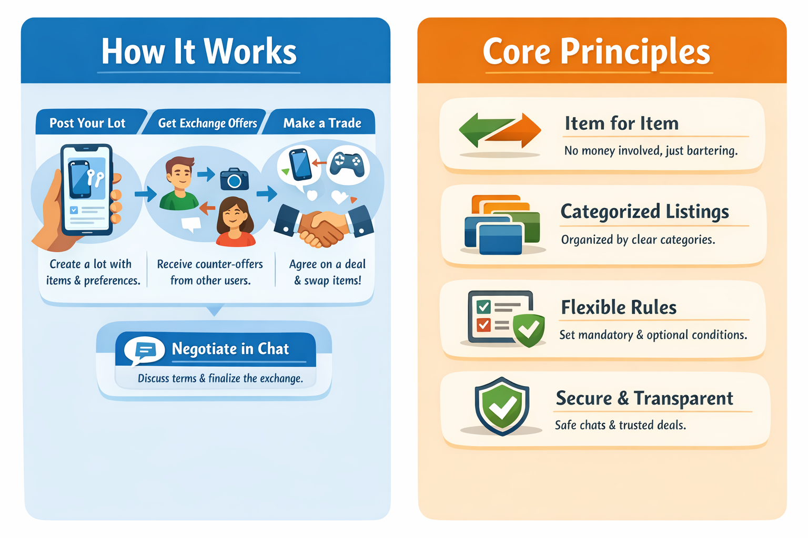
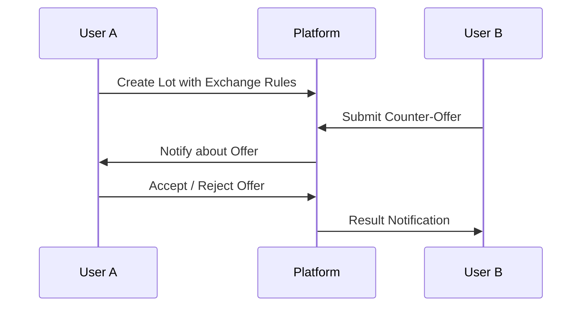

# Barter Platform

> A category-driven marketplace for direct item exchange without money.



## Overview

This project is a web-based barter marketplace where users exchange goods directly with each other instead of using money.  
The platform focuses on structured listings, flexible exchange rules, and transparent negotiation through built-in chats.

Unlike classic marketplaces, value here is not expressed in currency — it is negotiated through mutually acceptable offers.

The system is designed as a client–server application with a modern frontend and a typed backend, optimized for clarity, scalability, and future growth.

---

## Core Concept

The platform operates around **lots** — collections of one or multiple items offered by a user for exchange.

Each lot:

- Belongs to one or more categories
- Can contain **multiple items** (multi-lot support)
- Defines **exchange preferences and constraints**
- Can receive **counter-offers** from other users

There is no payment system.  
Every successful transaction is a **direct agreement between users**.

---

## Exchange Model

### Lots

A lot represents what a user is offering.

Examples:

- Single-item lot (e.g. _Laptop_)
- Multi-item lot (e.g. _Smartphone + Headphones_)

Each lot includes:

- Title & description
- Items list
- Category mapping
- Exchange rules
- Media attachments (images, documents)

---

### Exchange Preferences

When publishing a lot, the owner can specify:

- Desired categories of counter-lots
- Required number of lots in exchange:
  - exactly one
  - one or more
- Mandatory requirements (must be met)
- Optional preferences (nice to have)

These rules are validated when a counter-offer is created.

---

### Counter-Offers

Other users may respond to a lot by proposing:

- One or multiple of their own lots
- Additional comments or clarifications

The system ensures:

- Mandatory rules are enforced
- Optional preferences are visible but not blocking

The final decision is always made by the lot owner.

---

## Categories

The platform uses a **deep hierarchical category system**.

Key properties:

- Unlimited nesting levels
- Each lot belongs to at least one category
- Category structure is shared across the platform
- Designed to match user expectations of large classified marketplaces

> Categories are treated as core domain data and influence search, filtering, and exchange logic.

---

## Communication

Each exchange creates a **private chat** between involved users.

Chat features:

- Text messages
- File attachments:
  - PNG
  - JPG
  - PDF
- Exchange context awareness (linked to specific lots)

Chats exist to:

- Clarify details
- Negotiate conditions
- Finalize agreements

---

## System Architecture

The project follows a **client–server architecture**.

### High-level components:

- Frontend (web client)
- Backend (API & business logic)
- Media storage
- Optional auxiliary services

The system is intentionally modular to allow future extensions such as:

- Moderation tools
- Reputation systems
- Smart recommendations

---

## Domain Model (Conceptual)

### Main entities:

- User
- Lot
- Item
- Category
- ExchangeOffer
- Chat
- Message
- Attachment

---

## Diagrams

### Exchange Flow



## Barter Platform — Технологический стек и план разработки

## Технологический стек

### Frontend

- **Язык:** TypeScript
- **Фреймворк:** React
- **UI-библиотека:** Mantine
- **State-manager:** Redux
- **Иконки** Lucide
- **Стили:** SCSS
- **Кодстайл:** Prettier + ESLint
- **Адаптивность:** mobile-first, responsive design
- **Архитектура:** соблюдение SOLID, компонентная архитектура, хуки, сервисы
- **WebSocket:** Socket.IO для уведомлений и чатов

### Backend

- **Язык:** TypeScript
- **Фреймворк:** NestJS
- **ORM:** TypeORM
- **База данных:** PostgreSQL
- **WebSocket:** Socket.IO (реализация через Gateway NestJS)
- **Аутентификация:** JWT + bcryptjs (offline-совместимый)
- **Валидация:** class-validator, DTO
- **Защита от DOS атак:** redis
- **Логирование:** winston, nest-winston
- **Письма email:** nodemailer (с обёрткой @nestjs-modules/mailer для NestJS)
- **API документация**: nestjs/swagger (встроенный в NestJS).
- **Файловая безопасность:** локальный антивирусный сервис (проверка PNG, JPG, PDF)
- **Медиа:** jimp для обработки изображений
- **Архитектура:** модульная, SOLID, DI, слои: контроллеры → сервисы → репозитории
- **DevOps:** Docker, локальный npm-кэш, оффлайн сборка

---

## Дорожная карта разработки

### Этап 1: Пользователи и админка

- Регистрация и авторизация (JWT, bcryptjs)
- Роли пользователей (admin / user)
- Админка: просмотр и управление пользователями
- Структура проекта: модуль Auth, модуль Users
- Настройка Docker для локальной разработки и оффлайн сборки

### Этап 2: Лоты, категории и обмены

- CRUD для категорий (иерархическая структура)
- CRUD для лотов (одиночные и мульти-лоты)
- Настройка правил обмена (mandatory / optional preferences)
- Механизм counter-offers и уведомлений
- Валидация правил обмена на backend
- Структура проекта: модуль Lots, модуль Categories, модуль ExchangeOffers

### Этап 3: Чат с файлообменником

- Реализация WebSocket чатов через NestJS Gateway
- Привязка чатов к конкретным лотам и сделкам
- Поддержка вложений: PNG, JPG, PDF
- Интеграция локального антивируса для проверки файлов
- Структура проекта: модуль Chat, модуль Attachments

### Этап 4: Дополнительно (опционально)

- Репутация пользователей
- Рекомендации по лотам и пользователям
- Модерация контента
- Расширение системы уведомлений и масштабирование (в будущем Redis)

---

## Особенности реализации

- Весь код фронтенда и бэкенда строго на TypeScript
- SOLID и модульная архитектура на NestJS
- Возможность полностью оффлайн сборки через Docker + локальный npm-кэш
- WebSocket для мгновенной работы чатов и уведомлений
- Безопасность файлов через локальный антивирусный сервис

---

## Предлагаемая структура проекта

```txt
barter-platform/
│
├── client/ # Frontend
│ ├── public/ # Статические файлы (favicon, index.html)
│ ├── src/
│ │ ├── app/
│ │ │   ├── App.tsx
│ │ │   ├── providers/
│ │ │   │   ├── AppProviders.tsx
│ │ │   │   ├── RouterProvider.tsx
│ │ │   │   └── MantineProvider.tsx
│ │ │   │
│ │ │   ├── routes/
│ │ │   │   ├── index.tsx
│ │ │   │   ├── private.routes.tsx
│ │ │   │   └── public.routes.tsx
│ │ │   │
│ │ │   └── layouts/
│ │ │       ├── PublicLayout.tsx
│ │ │       └── PrivateLayout.tsx
│ │ │
│ │ ├── pages/
│ │ │   ├── auth/
│ │ │   │   └── AuthPage.tsx
│ │ │   └── placeholder/
│ │ │       └── AuthorizedPage.tsx
│ │ │
│ │ ├── shared/
│ │ │   ├── hooks/
│ │ │   │   └── useAuth.ts
│ │ │   ├── store/
│ │ │   │   └── auth.store.ts
│ │ │   └── types/
│ │ │
│ │ ├── main.tsx
│ │ └── index.scss
│
├── server/ # Backend
│ ├── src/
│ │ ├── app.module.ts # Главный модуль NestJS
│ │ ├── main.ts # Точка входа backend
│ │ ├── common/ # Общие утилиты, интерфейсы, мидлвейры и сервисы
│ │ │ ├── interfaces/ # Пользовательские интерфейсы
│ │ │ ├── middlewares/ # Общие мидлвейры API
│ │ │ ├── services/ # различные сторонние используемые сервисы (redis, winston, ..)
│ │ ├── modules/ # Модули приложения
│ │ │ ├── auth/ # Регистрация, логин, JWT аутентификация (auth, roles guard)
│ │ │ ├── users/ # Пользовательские маршруты
│ │ │ ├── countries/ # Маршруты для данных стран
│ │ │ └── mail/ # Маршруты для отправки писем на email
│ │ └── database/ # Настройка TypeORM, миграции, сущности
│ │   ├── entities/ # Entity-классы (User, Role, Settings)
│ │   ├── migrations/ # Миграции базы данных
│ │   └── seeds/ # Начальные данные
│ └── package.json
│
├── docker/ # Docker файлы и конфигурации
│ ├── Dockerfile.client
│ ├── Dockerfile.server
│ └── docker-compose.yml
│
├── .eslintrc.js
├── .prettierrc
├── tsconfig.json
└── README.md
```

## Запуск через `Docker` из корня проекта

### 🔹 DEV режим (разработка, hot-reload)

Запуск из корня репозитория:

```bash
docker compose -f docker/docker-compose.dev.yml up --build
```

Приостановка из корня репозитория:

```bash
docker compose -f docker/docker-compose.dev.yml down
```

### 🔹 PROD режим (чистый, минимальный контейнер)

Запуск из корня репозитория:

```bash
docker compose -f docker/docker-compose.prod.yml  up --build -d
```

Приостановка из корня репозитория:

```bash
docker compose -f docker/docker-compose.prod.yml down
```

---

> **Команды используемые при разработке:**

_Создание сервиса `NestJS`_

```bash
cd server
nest g service modules/{entityName}
```

_Создание модуля `NestJS`_

```bash
cd server
nest g module modules/{entityName}
```

_Создание контроллера `NestJS`_

```bash
cd server
nest g controller modules/{entityName}
```

---

> **Логика работы REST API в NextJS:**

В `NestJS` ВСЁ строится вокруг модулей.

```scss
HTTP запрос
   ↓
Controller  →  Service  →  Repository (TypeORM)  →  Database
```

- **Controller** — принимает HTTP-запросы
- **Service** — бизнес-логика
- **Repository** — работа с БД (через TypeORM)
- **Database** — непосредственно БД (Postgre)
- **Module** — склеивает всё это вместе
