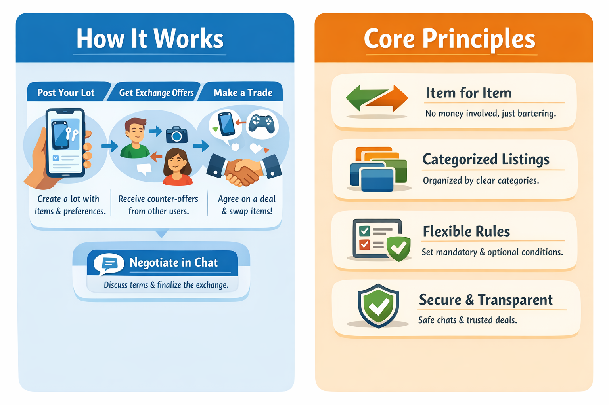
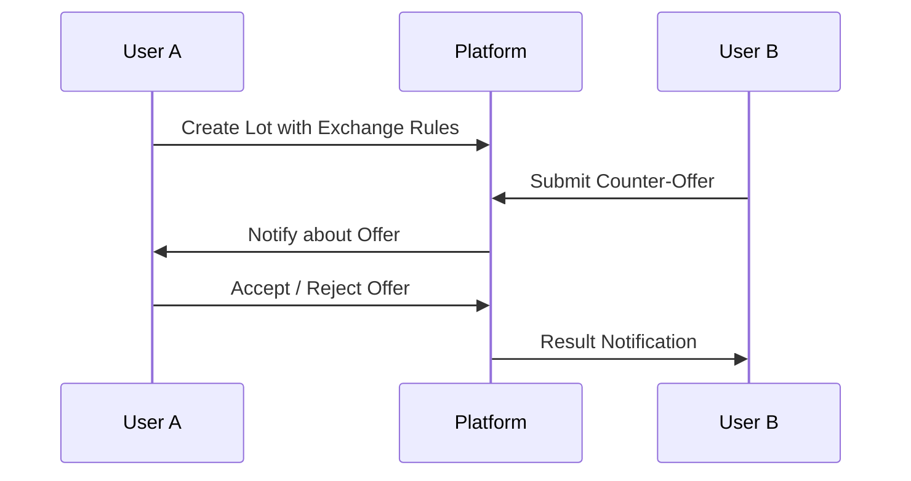

# Barter Platform

> A category-driven marketplace for direct item exchange without money.



## Overview

This project is a web-based barter marketplace where users exchange goods directly with each other instead of using money.  
The platform focuses on structured listings, flexible exchange rules, and transparent negotiation through built-in chats.

Unlike classic marketplaces, value here is not expressed in currency — it is negotiated through mutually acceptable offers.

The system is designed as a client–server application with a modern frontend and a typed backend, optimized for clarity, scalability, and future growth.

---

## Core Concept

The platform operates around **lots** — collections of one or multiple items offered by a user for exchange.

Each lot:

- Belongs to one or more categories
- Can contain **multiple items** (multi-lot support)
- Defines **exchange preferences and constraints**
- Can receive **counter-offers** from other users

There is no payment system.  
Every successful transaction is a **direct agreement between users**.

---

## Exchange Model

### Lots

A lot represents what a user is offering.

Examples:

- Single-item lot (e.g. _Laptop_)
- Multi-item lot (e.g. _Smartphone + Headphones_)

Each lot includes:

- Title & description
- Items list
- Category mapping
- Exchange rules
- Media attachments (images, documents)

---

### Exchange Preferences

When publishing a lot, the owner can specify:

- Desired categories of counter-lots
- Required number of lots in exchange:
  - exactly one
  - one or more
- Mandatory requirements (must be met)
- Optional preferences (nice to have)

These rules are validated when a counter-offer is created.

---

### Counter-Offers

Other users may respond to a lot by proposing:

- One or multiple of their own lots
- Additional comments or clarifications

The system ensures:

- Mandatory rules are enforced
- Optional preferences are visible but not blocking

The final decision is always made by the lot owner.

---

## Categories

The platform uses a **deep hierarchical category system**.

Key properties:

- Unlimited nesting levels
- Each lot belongs to at least one category
- Category structure is shared across the platform
- Designed to match user expectations of large classified marketplaces

> Categories are treated as core domain data and influence search, filtering, and exchange logic.

---

## Communication

Each exchange creates a **private chat** between involved users.

Chat features:

- Text messages
- File attachments:
  - PNG
  - JPG
  - PDF
- Exchange context awareness (linked to specific lots)

Chats exist to:

- Clarify details
- Negotiate conditions
- Finalize agreements

---

## System Architecture

The project follows a **client–server architecture**.

### High-level components:

- Frontend (web client)
- Backend (API & business logic)
- Media storage
- Optional auxiliary services

The system is intentionally modular to allow future extensions such as:

- Moderation tools
- Reputation systems
- Smart recommendations

---

## Domain Model (Conceptual)

### Main entities:

- User
- Lot
- Item
- Category
- ExchangeOffer
- Chat
- Message
- Attachment

---

## Diagrams

### Exchange Flow


```mermaid
sequenceDiagram
    participant U1 as User A
    participant S as Platform
    participant U2 as User B

    U1->>S: Create Lot with Exchange Rules
    U2->>S: Submit Counter-Offer
    S->>U1: Notify about Offer
    U1->>S: Accept / Reject Offer
    S->>U2: Result Notification
```

## Barter Platform — Технологический стек и план разработки

## Технологический стек

### Frontend

- **Язык:** TypeScript
- **Фреймворк:** React
- **UI-библиотека:** Mantine
- **State-manager:** Redux
- **Иконки** Lucide
- **Стили:** SCSS
- **Кодстайл:** Prettier + ESLint
- **Адаптивность:** mobile-first, responsive design
- **Архитектура:** соблюдение SOLID, компонентная архитектура, хуки, сервисы
- **WebSocket:** Socket.IO для уведомлений и чатов

### Backend

- **Язык:** TypeScript
- **Фреймворк:** NestJS
- **ORM:** TypeORM
- **База данных:** PostgreSQL
- **WebSocket:** Socket.IO (реализация через Gateway NestJS)
- **Аутентификация:** JWT + bcryptjs (offline-совместимый)
- **Валидация:** class-validator, DTO
- **Защита от DOS атак:** redis
- **Логирование:** winston, nest-winston
- **Письма email:** nodemailer (с обёрткой @nestjs-modules/mailer для NestJS)
- **API документация**: nestjs/swagger (встроенный в NestJS).
- **Файловая безопасность:** локальный антивирусный сервис (проверка PNG, JPG, PDF)
- **Медиа:** jimp для обработки изображений
- **Архитектура:** модульная, SOLID, DI, слои: контроллеры → сервисы → репозитории
- **DevOps:** Docker, локальный npm-кэш, оффлайн сборка

---

## Дорожная карта разработки

### Этап 1: Пользователи и админка

- Регистрация и авторизация (JWT, bcryptjs)
- Роли пользователей (admin / user)
- Админка: просмотр и управление пользователями
- Структура проекта: модуль Auth, модуль Users
- Настройка Docker для локальной разработки и оффлайн сборки

### Этап 2: Лоты, категории и обмены

- CRUD для категорий (иерархическая структура)
- CRUD для лотов (одиночные и мульти-лоты)
- Настройка правил обмена (mandatory / optional preferences)
- Механизм counter-offers и уведомлений
- Валидация правил обмена на backend
- Структура проекта: модуль Lots, модуль Categories, модуль ExchangeOffers

### Этап 3: Чат с файлообменником

- Реализация WebSocket чатов через NestJS Gateway
- Привязка чатов к конкретным лотам и сделкам
- Поддержка вложений: PNG, JPG, PDF
- Интеграция локального антивируса для проверки файлов
- Структура проекта: модуль Chat, модуль Attachments

### Этап 4: Дополнительно (опционально)

- Репутация пользователей
- Рекомендации по лотам и пользователям
- Модерация контента
- Расширение системы уведомлений и масштабирование (в будущем Redis)

---

## Особенности реализации

- Весь код фронтенда и бэкенда строго на TypeScript
- SOLID и модульная архитектура на NestJS
- Возможность полностью оффлайн сборки через Docker + локальный npm-кэш
- WebSocket для мгновенной работы чатов и уведомлений
- Безопасность файлов через локальный антивирусный сервис

---

## Текущая структура проекта

> Frontend организован по методологии **Feature-Sliced Design (FSD)**: слои `app → pages → widgets → features → entities → shared`.
> Backend построен на модульной архитектуре **NestJS**: `controllers → services → repositories (TypeORM) → database`.

```txt
barter-platform/
│
├── client/                            # Frontend (React + Vite + TypeScript)
│ ├── public/                          # Статические файлы (favicon, index.html)
│ ├── src/
│ │ ├── app/                           # Инициализация приложения
│ │ │ ├── App.tsx                      # Корневой компонент
│ │ │ ├── main.tsx                     # Точка входа
│ │ │ ├── i18n/                        # Конфигурация i18next и ресурсы переводов
│ │ │ ├── providers/                   # AppProvider, RouterProvider, MantineProvider, QueryProvider, AuthBootstrap
│ │ │ ├── router/                      # routes.tsx и guards (RequireAuth, RequireAdmin)
│ │ │ ├── store/                       # Корневой Redux store
│ │ │ └── styles/                      # globals.scss, переменные, Mantine-модуль
│ │ │
│ │ ├── pages/                         # Страницы приложения
│ │ │ ├── admin/                       # Админ-панель
│ │ │ ├── auth/                        # Логин / регистрация
│ │ │ ├── feed/                        # Лента лотов
│ │ │ ├── lot/                         # Просмотр конкретного лота
│ │ │ ├── lot-form/                    # Создание / редактирование лота
│ │ │ ├── mail-confirm/                # Подтверждение email
│ │ │ ├── my-lots/                     # Лоты текущего пользователя
│ │ │ ├── profile/                     # Профиль пользователя
│ │ │ └── reset-password/              # Сброс пароля
│ │ │
│ │ ├── widgets/                       # Композитные UI-блоки
│ │ │ ├── AppHeader/                   # Шапка приложения
│ │ │ ├── AppNavbar/                   # Боковая навигация
│ │ │ ├── AppShell/                    # Каркас layout’а
│ │ │ ├── LotActions/                  # Действия над лотом
│ │ │ ├── LotForm/                     # Форма лота с секциями
│ │ │ ├── LotsFeed/                    # Лента карточек лотов
│ │ │ ├── ProfileContactsBlock/
│ │ │ ├── ProfileHeaderBlock/
│ │ │ └── ProfilePreferencesBlock/
│ │ │
│ │ ├── features/                      # Пользовательские сценарии (feature-слои FSD)
│ │ │ ├── admin/                       # Таблицы, фильтры и колонки админки
│ │ │ ├── auth/                        # login, register, logout, forgot/reset password, bootstrap, auth-required
│ │ │ ├── category-filter/             # Drawer выбора категорий
│ │ │ ├── geo-filter/                  # Гео-фильтр
│ │ │ ├── lot-form/                    # Логика формы лота (state, submit, images)
│ │ │ ├── lot-status/                  # Смена статуса лота
│ │ │ ├── profile/                     # avatar, deactivation, edit
│ │ │ └── search-filter/               # Поиск
│ │ │
│ │ ├── entities/                      # Доменные сущности (модели + API + UI)
│ │ │ ├── geography/                   # Страны / регионы / города / районы
│ │ │ ├── lot/                         # Лоты
│ │ │ ├── rate-limit/                  # Состояние rate-limit
│ │ │ ├── taxonomy/                    # Главы и категории
│ │ │ └── user/                        # Пользователь
│ │ │
│ │ └── shared/                        # Переиспользуемое ядро
│ │   ├── api/                         # axios-клиент и interceptors (auth, language, rateLimit)
│ │   ├── constants/                   # Константы и enum-ы
│ │   ├── hooks/                       # Общие React-хуки
│ │   ├── lib/                         # Утилиты (alertPresets, errorHandler, …)
│ │   └── ui/                          # Базовые UI-компоненты
│ │
│ ├── eslint.config.js
│ ├── tsconfig.json / tsconfig.app.json / tsconfig.node.json
│ ├── vite.config.ts
│ └── package.json
│
├── server/                            # Backend (NestJS + TypeORM + PostgreSQL)
│ ├── src/
│ │ ├── main.ts                        # Точка входа backend
│ │ ├── app.module.ts                  # Корневой модуль NestJS
│ │ ├── app.controller.ts / app.service.ts
│ │ │
│ │ ├── common/                        # Общие утилиты и инфраструктура
│ │ │ ├── constants/                   # Общие константы
│ │ │ ├── decorators/                  # Кастомные декораторы (transform-json, …)
│ │ │ ├── dtos/                        # Общие DTO (filter, sort, geo-node, …)
│ │ │ ├── interfaces/                  # auth-request, jwt-payload, redis-session, …
│ │ │ ├── middlewares/                 # device.middleware и др.
│ │ │ ├── services/                    # Сторонние сервисы (logger/winston и т.п.)
│ │ │ ├── throttling/                  # Защита от перебора / rate limit
│ │ │ ├── types/                       # Общие типы
│ │ │ └── utils/                       # query-filters, load-seed, …
│ │ │
│ │ ├── modules/                       # Доменные модули приложения
│ │ │ ├── auth/                        # Регистрация, логин, JWT, guards, policies
│ │ │ ├── users/                       # Управление пользователями (self + admin)
│ │ │ ├── mail/                        # Отправка писем (nodemailer + шаблоны)
│ │ │ ├── mail-confirm/                # Подтверждение email
│ │ │ ├── password-reset/              # Сброс пароля
│ │ │ ├── deactivation/                # Деактивация аккаунта
│ │ │ ├── media/                       # Загрузка/обработка медиа (jimp), guards
│ │ │ ├── lots/                        # Лоты, таксономия, DTO и ошибки
│ │ │ └── redis/                       # Redis-модуль (сессии, throttling)
│ │ │
│ │ └── database/                      # TypeORM
│ │   ├── data-source.ts               # Конфигурация DataSource
│ │   ├── entities/                    # Entity-классы (User, Lot, Session, MediaFile, …)
│ │   ├── migrations/                  # Миграции БД
│ │   ├── seeds/                       # Начальные данные (geography, chapter, category, admin, …)
│ │   ├── subscribers/                 # TypeORM-подписчики
│ │   └── seed.ts                      # Раннер сидов
│ │
│ ├── test/                            # e2e-тесты
│ ├── media/                           # Локальное хранилище медиа (dev)
│ ├── logs/                            # Файлы логов winston
│ ├── eslint.config.mjs
│ ├── nest-cli.json
│ ├── tsconfig.json / tsconfig.build.json
│ └── package.json
│
├── docker/                            # Docker-конфигурации
│ ├── Dockerfile.client
│ ├── Dockerfile.server
│ ├── docker-compose.dev.yml
│ ├── docker-compose.prod.yml
│ └── nginx.client.conf
│
├── logs/                              # Общие логи запуска
├── business.png                       # Концепт-схема платформы
├── icon.png
└── README.md
```

## Запуск через `Docker` из корня проекта

### 🔹 DEV режим (разработка, hot-reload)

Запуск из корня репозитория:

```bash
docker compose -f docker/docker-compose.dev.yml up --build
```

Приостановка из корня репозитория:

```bash
docker compose -f docker/docker-compose.dev.yml down
```

### 🔹 PROD режим (чистый, минимальный контейнер)

Запуск из корня репозитория:

```bash
docker compose -f docker/docker-compose.prod.yml  up --build -d
```

Приостановка из корня репозитория:

```bash
docker compose -f docker/docker-compose.prod.yml down
```

---

> **Команды используемые при разработке:**

_Создание сервиса `NestJS`_

```bash
cd server
nest g service modules/{entityName}
```

_Создание модуля `NestJS`_

```bash
cd server
nest g module modules/{entityName}
```

_Создание контроллера `NestJS`_

```bash
cd server
nest g controller modules/{entityName}
```

---

> **Генерация миграций базы данных (TypeORM):**

> !!!НЕ ЗАБЫВАЕМ ПРОВЕРЯТЬ `src/database/entities/index.ts` НА НАЛИЧИЕ ВСЕХ СУЩНОСТЕЙ!!!

1. Проверяем, что сервер в режиме **development**:

```env
NODE_ENV=development
```

2. Отключаем автосинхронизацию для миграций:

`src/app.module.ts`

```ts
synchronize: false, // для новых миграций через dev контейнер
// synchronize: config.get('NODE_ENV') === 'development', // dev only
```

`src/database/data-source.ts`

```ts
synchronize: false, // для новых миграций через dev контейнер
// synchronize: process.env.NODE_ENV === 'development',
```

3. Удаляем volume’ы сервера (Postgres/Redis можно оставить):

```bash
docker volume prune
```

4. Собираем и запускаем dev-контейнер сервера:

```bash
docker compose -f docker/docker-compose.dev.yml up --build
```

5. Заходим внутрь контейнера сервера:

```bash
docker exec -it server-dev bash
```

6. Генерируем миграцию с указанием пути и префикса имени:

```bash
npm run typeorm -- migration:generate -d src/database/data-source.ts src/database/migrations/Init

```

> TypeORM автоматически добавит timestamp к имени файла.

7. Проверяем созданный файл миграции:

```ts
import { MigrationInterface, QueryRunner } from "typeorm";

export class Init1768496766397 implements MigrationInterface {
  name = "Init1768496766397";

  public async up(queryRunner: QueryRunner): Promise<void> {
    // SQL изменения
  }

  public async down(queryRunner: QueryRunner): Promise<void> {
    // rollback
  }
}
```

8. Возвращаем `synchronize: false` для production.

9. Закоммитить миграцию в репозиторий.

10. В production запускаем миграции командой:

```bash
npm run migration:run
```

---

> **Логика работы REST API в NextJS:**

В `NestJS` ВСЁ строится вокруг модулей.

```scss
HTTP запрос
   ↓
Controller  →  Service  →  Repository (TypeORM)  →  Database
```

- **Controller** — принимает HTTP-запросы
- **Service** — бизнес-логика
- **Repository** — работа с БД (через TypeORM)
- **Database** — непосредственно БД (Postgre)
- **Module** — склеивает всё это вместе
